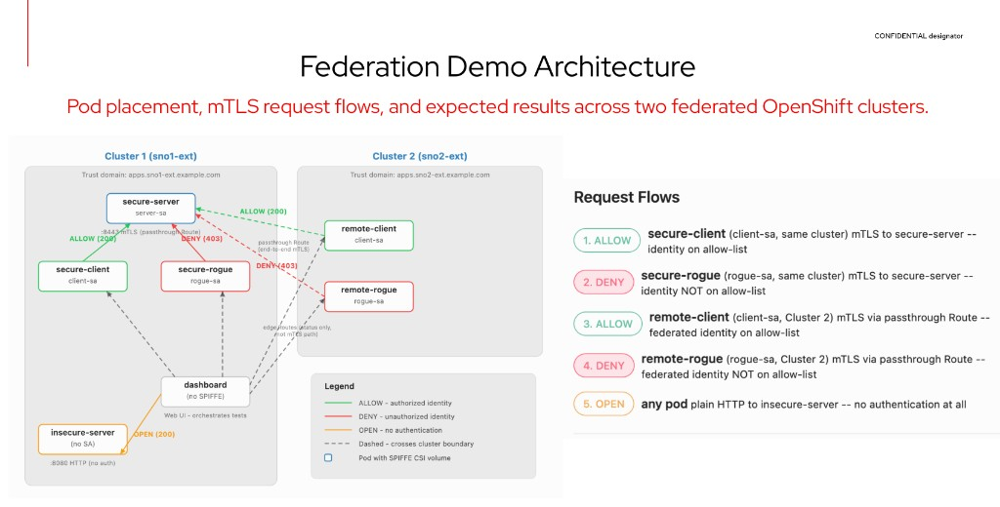

# Zero Trust Workload Identity — Federated mTLS Demo

A hands-on demo of **cross-cluster mTLS** using the
[Zero Trust Workload Identity Manager (ZTIDM)](https://docs.redhat.com/en/documentation/openshift_container_platform/4.22/html/security_and_compliance/zero-trust-workload-identity-manager)
operator on OpenShift.

Workloads on two federated clusters authenticate each other using
[SPIFFE](https://spiffe.io/) identities — no shared secrets, no IP
allow-lists, no sidecars.



## What the demo shows

| # | Flow | Expected | Description |
|---|------|----------|-------------|
| 1 | **insecure-server** | OPEN (200) | Plain HTTP — any pod can connect, no auth |
| 2 | **secure-client** → secure-server | ALLOW (200) | Same-cluster mTLS — `client-sa` identity on allow-list |
| 3 | **secure-rogue** → secure-server | DENY (403) | Same-cluster mTLS — `rogue-sa` NOT on allow-list |
| 4 | **remote-client** (Cluster 2) → secure-server | ALLOW (200) | Cross-cluster federation — federated `client-sa` accepted |
| 5 | **remote-rogue** (Cluster 2) → secure-server | DENY (403) | Cross-cluster federation — federated `rogue-sa` denied |

A **web dashboard** shows all five results in real-time.

## Prerequisites

- **Two OpenShift 4.16+ clusters** (SNO, compact, or standard — any topology)
- **OperatorHub access** (or mirror containing the ZTIDM operator)
- **Default StorageClass** on both clusters (for the SPIRE Server PVC).
  If none exists, use `install_and_config_lvm_op.sh` to set up LVM Storage.
- **DNS wildcard resolution** for `*.apps.<cluster>.example.com` on both
  clusters (standard OpenShift ingress)
- **`oc` CLI** (4.16+)
- **`jq`**, **`curl`** on the workstation

### DNS requirement for SPIRE agent (only for short node hostnames)

The ZTIDM SPIRE agent runs **without `hostNetwork`** (it uses
`hostPID: true` but standard pod networking with `dnsPolicy: ClusterFirst`).
The kubelet workload attestor resolves the Kubernetes node name from
inside a pod via ClusterFirst DNS.

**Most users won't need any action here.** If your nodes have FQDN names
(e.g. `node1.ocp.example.com`, `ip-10-0-1-42.ec2.internal`) — which is
the default for IPI, cloud, and most UPI installs — DNS resolution works
automatically.

If your nodes use **short hostnames** (e.g. `sno1`, `mesh1`) that aren't
in the cluster's upstream DNS, you need to either:

1. Add the records to your DNS server, **or**
2. Use a lightweight forwarder (e.g. `dnsmasq` on a bastion host) and
   configure the OpenShift DNS Operator to use it as an upstream:

```bash
# On your DNS/bastion host — add node records to dnsmasq
cat > /etc/dnsmasq.d/spire-nodes.conf <<EOF
address=/node1/10.0.1.10
address=/node2/10.0.1.11
EOF
sudo systemctl restart dnsmasq
sudo firewall-cmd --add-service=dns --permanent && sudo firewall-cmd --reload

# On each OpenShift cluster — add the forwarder as an upstream
oc patch dns.operator/default --type=merge -p '{
  "spec": {
    "upstreamResolvers": {
      "policy": "Sequential",
      "upstreams": [
        {"type": "Network", "address": "10.0.1.5", "port": 53},
        {"type": "SystemResolvConf", "port": 53}
      ]
    }
  }
}'
# Restart CoreDNS to pick up the change
oc delete pod -n openshift-dns -l dns.operator.openshift.io/daemonset-dns=default
```

## Quick start

```bash
# 1. Export kubeconfigs for both clusters
export KUBECONFIG1=~/.kube/cluster1
export KUBECONFIG2=~/.kube/cluster2

# 2. (Optional) Install LVM Storage if no default StorageClass exists
bash install_and_config_lvm_op.sh

# 3. Install ZTIDM operator, SPIRE operands, and configure federation
bash go.sh              # interactive — pauses between phases
bash go.sh --yes        # non-interactive

# 4. Deploy the demo application
bash demo-go.sh         # interactive
bash demo-go.sh --yes   # non-interactive

# 5. Open the dashboard
echo "https://dashboard-demo-zero-trust.$(oc --kubeconfig=$KUBECONFIG1 \
  get ingresses.config/cluster -o jsonpath='{.spec.domain}')"
```

## What gets deployed

### `go.sh` — ZTIDM infrastructure (both clusters)

| Phase | What |
|-------|------|
| 1 | ZTIDM operator (Namespace, OperatorGroup, Subscription) |
| 2 | SPIRE operands (ZeroTrustWorkloadIdentityManager, SpireServer, SpireAgent, SpiffeCSIDriver, SpireOIDCDiscoveryProvider) — with `https_spiffe` federation profile |
| 3 | Federation (ClusterFederatedTrustDomain on each cluster pointing to the other, SpireServer `federatesWith` patch) |
| 4 | Verification (federation endpoints, trust bundle exchange, SPIRE server logs) |

Generated YAML is saved to `./<cluster-name>/` for inspection.

### `demo-go.sh` — demo application

**Cluster 1:**
- `insecure-server` — plain HTTP endpoint (no auth)
- `secure-server` — mTLS endpoint with SPIFFE identity-based allow-list, exposed via passthrough Route for cross-cluster access
- `secure-client` — authorized mTLS client (`client-sa`)
- `secure-rogue` — unauthorized mTLS client (`rogue-sa`)
- `dashboard` — web UI that orchestrates tests and shows results

**Cluster 2:**
- `remote-client` — authorized federated client (`client-sa` from Cluster 2)
- `remote-rogue` — unauthorized federated rogue (`rogue-sa` from Cluster 2)

### How mTLS works in the demo

1. Each pod gets an **X.509-SVID** (short-lived certificate) from SPIRE via the CSI driver
2. The SVID encodes the pod's identity: `spiffe://<trust-domain>/ns/<namespace>/sa/<service-account>`
3. The **secure-server** requires mTLS and extracts the client's SPIFFE ID from the certificate's URI SAN
4. It checks the ID against an allow-list → **ALLOW** (200) or **DENY** (403)
5. For cross-cluster: the passthrough Route preserves end-to-end mTLS. The `ClusterSPIFFEID` with `federatesWith` ensures workloads receive both local and remote trust bundles.
6. **Hot cert reload**: both server and client pods refresh their SVIDs and trust bundles every 5 minutes via a background thread, so the demo runs indefinitely without cert expiry.

## Teardown

```bash
# Remove just the demo app (keeps ZTIDM infrastructure)
bash demo-delete.sh         # interactive
bash demo-delete.sh --yes   # non-interactive

# Full teardown — removes everything (operator, CRDs, namespace)
bash delete.sh              # interactive — requires typing 'yes'
bash delete.sh --yes        # non-interactive
```

## Troubleshooting

| Symptom | Cause | Fix |
|---------|-------|-----|
| SpireServer PVC stuck `Pending` | No default StorageClass | Run `install_and_config_lvm_op.sh` or create a StorageClass |
| SPIRE agent pod `CrashLoopBackOff` with `lookup <node>: no such host` | Node hostname not resolvable from inside pods (ZTIDM v1.1.1+ runs without hostNetwork) | Add node DNS records — see [DNS requirement](#dns-requirement-for-spire-agent-ztidm-v111) |
| Dashboard shows `ERROR` on client cards | SPIFFE SVIDs expired (short TTL) and client didn't refresh | Restart the affected deployment: `oc rollout restart deployment/<name>` |
| Federation endpoint returns `EOF` | Transient — both SPIRE servers starting simultaneously | Wait 1-2 minutes, then verify with `curl -sk https://federation.<apps-domain>` |
| `ClusterSPIFFEID` created but `spire-server entry show` returns 0 entries | Missing `className: zero-trust-workload-identity-manager-spire` | Ensure all `ClusterSPIFFEID` resources include the `className` field |
| Namespace stuck in `Terminating` | Pods with CSI volumes can't unmount after SPIRE agent is deleted | Force-delete stuck pods: `oc delete pod <name> --force --grace-period=0` then clear namespace finalizers |

## Files

| File | Purpose |
|------|---------|
| `go.sh` | Install ZTIDM + SPIRE + federation on two clusters |
| `demo-go.sh` | Deploy the five-flow demo application |
| `delete.sh` | Full teardown (operator, CRDs, everything) |
| `demo-delete.sh` | Remove demo app only (keeps infrastructure) |
| `install_and_config_lvm_op.sh` | Optional: install LVM Storage operator + create LVMCluster |
| `diagrams/` | Architecture diagrams (.drawio source + .png) |

## References

- [ZTIDM Documentation (OCP 4.22)](https://docs.redhat.com/en/documentation/openshift_container_platform/4.22/html/security_and_compliance/zero-trust-workload-identity-manager)
- [SPIFFE specification](https://spiffe.io/)
- [SPIRE project](https://github.com/spiffe/spire)
- [Tornjak — SPIRE management UI](https://github.com/spiffe/tornjak)

## License

Apache License 2.0
